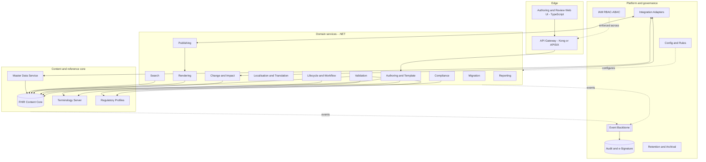
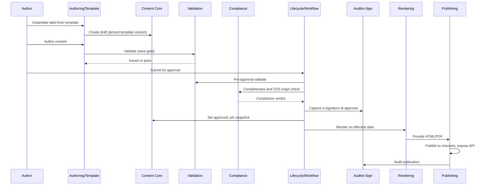
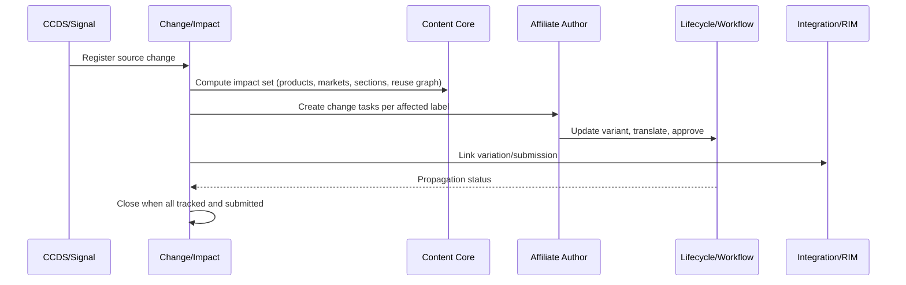

# D3 - Detailed Technical Architecture
## FHIR ePI Enterprise System

**Status:** Draft v0.1, **Date:** 2026-08-13, **Audience:** Internal engineering (prescriptive)
**Companion:** D1 Solution Overview, D2.1-D2.6 Capability Specifications, Deliverables Definition.

> **Reading note on technology choices.** Technology selection is made here in D3. The **primary stack is open-source and self-hostable**, deployed **Docker-first for development and Kubernetes for higher environments and production**; every component ships as a maintained container image (Section 12 lists them). **MinIO with object-lock provides WORM** storage for audit and long-term retention in all environments, with no cloud dependency. Application services are built in **.NET (C#)**; several adopted OSS components are JVM-based (HAPI FHIR, Snowstorm, Keycloak, Kafka) and run as containers - a polyglot platform integrated via APIs and events. A **managed Azure stack is a supported future target**: the same container images and portable abstractions (S3 API, PostgreSQL, Kafka API, OpenTelemetry, FHIR/OpenAPI/AsyncAPI contracts) lift onto AKS + managed services with no rewrite; Section 12 maps each layer's Azure equivalent. Named products are recommendations with alternatives (ADRs, Section 14), subject to the mandated-vs-open components (Deliverables Definition Section 11). Nothing in the capability behaviour (D2) depends on a specific product.

---

## 1. Architecture overview & drivers

### 1.1 Purpose
A prescriptive, buildable architecture realising the 24 target capabilities (D2) as a cloud-native, API-first, event-driven platform with a FHIR-native content core and a GxP-grade governance layer.

### 1.2 Architectural drivers (from D1)
- **FHIR-native single source of truth**; all representations derive from it.
- **Multi-region / multi-affiliate** with strict data scoping and isolation.
- **Deterministic lifecycle, versioning, and change propagation** with full audit.
- **Config-as-data extensibility** - new market/regulator/rule without a code release.
- **Validatable by design** (GxP / 21 CFR Part 11 / EU Annex 11 / GAMP 5).
- **Event-driven** change propagation, notification, and integration.

### 1.3 Decision method
Significant decisions are recorded as **ADRs** (Section 14). Each resolves a D1 Section 6 target-state decision or a mandated-vs-open component. ADRs are living records versioned with the architecture.

### 1.4 Architecture style
- **Modular services** aligned to capability domains (not fine-grained microservices for their own sake); a **modular monolith or coarse-grained services** to start, decomposable along seams already drawn in D2.
- **FHIR core** as the canonical content service; surrounding domain services own workflow, change, compliance, rendering, publishing.
- **Event backbone** as the asynchronous spine.
- **Governance layer** (IAM, audit, config, security) cross-cutting every service.

---

## 2. Logical architecture

### 2.1 Component / service decomposition
Each service maps to one or more D2 capabilities (numbers in brackets).

| Service | Capabilities | Responsibility |
|---|---|---|
| **Authoring & Template Service** | 1, 3, part of 2 | Ingestion on-ramp, template instantiation, guided authoring |
| **Content Core (FHIR)** | 2 | Canonical FHIR ePI store, resource graph, reusable units, cross-refs |
| **Terminology Service** | 6 | Code systems, value sets, bindings, validate/expand/lookup/translate |
| **Master Data Service** | 5 | IDMP/SPOR linkage, product-packaging-label association, local replica |
| **Lifecycle & Workflow Service** | 7, 16 | Label state machine, versioning, approvals, e-signature invocation |
| **Change & Impact Service** | 8 | Source-change intake, impact analysis, propagation, variation links |
| **Localisation & Translation Service** | 9 | Variants, translation workflow, TM, linguistic review |
| **Regulatory Profiles Service** | 10 | Conformance profiles, mappings, national extensions |
| **Validation Service** | 11 | Technical FHIR/terminology/structural validation |
| **Compliance Service** | 12 | Completeness vs template, rules, CDS-origin checks |
| **Rendering Service** | 13 | FHIR to HTML/PDF, scheme transforms, styling, accessibility |
| **Publishing Service** | 14 | Channel publication, effective-dating, embargo, published API |
| **Search Service** | 15 | FHIR search, full-text/structured query |
| **Migration Service** | 4 | Bulk legacy onboarding, reconciliation, remediation |
| **Notification & Event Backbone** | 20 | Pub/sub, FHIR Subscription, notifications |
| **Configuration & Rules Service** | 21 | Config-as-data, rule engine, environment promotion |
| **Retention & Archival Service** | 22 | Retention schedules, legal hold, archival, disposition |
| **Reporting & Analytics** | 23 | Dashboards, regulatory reporting, analytics store |
| **Integration & Adapters** | 24 | External system adapters, anti-corruption layers |
| **IAM** | 17 | AuthN/federation, RBAC/ABAC policy decision |
| **Security** | 18 | Encryption, secrets, network/app security |
| **Audit & e-Signature** | 19 | Immutable audit sink, Part 11 signatures, inspection |

### 2.2 Logical component diagram

### 2.3 Boundaries
Services communicate via well-defined APIs (synchronous) and the event backbone (asynchronous). External systems are reached only through Integration adapters (24). No service reaches another's datastore directly.

---

## 3. Data architecture

### 3.1 Stores (canonical vs derived)

| Store | Content | Recommended (open-source) | Azure target (future) |
|---|---|---|---|
| **FHIR Content Core** | Canonical ePI Bundles, product graph, reusable units, versions | HAPI FHIR over PostgreSQL | Azure Health Data Services FHIR |
| **Operational DB** | Workflow, jobs, change records, config metadata | PostgreSQL | Azure Database for PostgreSQL |
| **Terminology store** | CodeSystem/ValueSet/ConceptMap | Snowstorm (+ Elasticsearch 8) and HAPI FHIR terminology | self-hosted (same images) |
| **Binary/Asset store** | Source docs, **artwork PDFs**, **rendered PDFs/HTML** | MinIO (S3 API) | Azure Blob Storage |
| **Content search index** | Full-text + structured content/metadata | OpenSearch | Azure AI Search |
| **Event log/stream** | Domain events | Apache Kafka (KRaft) | Event Hubs (Kafka API) / Service Bus |
| **Audit store** | Immutable audit + e-signatures | Append-only in PostgreSQL, with **MinIO object-lock (WORM)** for sealed audit exports | Azure Blob immutable / SQL Ledger |
| **Analytics warehouse** | Reporting read models | PostgreSQL or ClickHouse/DuckDB | Azure Synapse / Fabric |
| **Archive store** | Long-term retention (WORM) | **MinIO object-lock with legal hold** | Azure Blob immutable + legal hold |

### 3.2 Canonical vs rendered separation
The **FHIR Content Core** holds only canonical structured content. **Rendered outputs** (HTML, rendered PDF) and **ingested artwork PDFs** live in the Asset store, each linked to a specific label version and (for renders) a render-template version. The **two PDF lineages** (D1 Section 3.3) are separate object classes in the Asset store with distinct metadata; they are never interchanged.

### 3.3 Content model and reuse
Canonical ePI = FHIR document `Bundle` + `Composition` + product-graph resources (D2.1 #2). **Reusable content units** are first-class versioned resources referenced by labels; resolution policy is **pinned-by-default** (a label pins the unit version approved with it) with an explicit "track-latest" option per unit (ADR-007). Cross-references are typed and integrity-checked.

### 3.4 Identifiers and versioning
Global, stable identifiers for documents, sections, and reusable units; semantic version lineage held in the FHIR core; immutable version snapshots. Per-market **regulatory-approval state** is modelled separately from internal lifecycle state (ADR-005), stored as label-market status records in the Operational DB, referencing the pinned content version.

### 3.5 Data residency and tenancy
Affiliate/market **data partitioning** (ADR-004): logical multi-tenancy with per-affiliate scoping enforced at the access layer, and physical partitioning where residency requires it (regional deployments/stores). Chosen model: logical isolation with attribute-based scoping, regional data stores where a market mandates residency.

---

## 4. Content processing architecture

Three pipelines, all event-driven, observable, and idempotent:

### 4.1 Ingestion/conversion pipeline (caps 1, 4)
Receive -> classify (ePI Bundle vs source doc vs artwork PDF) -> parse/extract -> structural pre-validate -> capture provenance -> stage -> register draft. Migration (4) runs the same pipeline in bulk with reconciliation and a remediation queue. SPL->FHIR transforms use maintained StructureMaps (cap 10).

### 4.2 Validation/compliance pipeline (caps 11, 12)
Triggered at gates (ingest, save, pre-approval, pre-publish). Runs FHIR profile validation and terminology checks (11), then completeness/rules/CDS-origin checks (12) against the active profile (10) and template (3). Emits structured `OperationOutcome`-style results and gate verdicts consumed by Lifecycle (7).

### 4.3 Rendering/publishing pipeline (caps 13, 14)
On approval + effective date: render FHIR -> HTML (accessible) and HTML -> PDF; produce official (approved) vs watermarked (draft) outputs; store to Asset store; publish to channels with retry/idempotency; expose via the published API. Heavy renders run asynchronously off the event backbone.

**Rendering toolchain (ADR-010):** FHIR -> HTML via a templating layer (Liquid/XSLT over the FHIR model); HTML -> PDF via a print engine. Recommended: **headless Chromium (Playwright)** for HTML+CSS fidelity and accessibility, with **Prince/Antenna House** as an alternative where regulated print typography demands it.

---

## 5. API & interface design

### 5.1 API surfaces
- **FHIR RESTful API** (primary external contract) - read/search/retrieve, plus FHIR Subscription. This is the **option-A published contract** the future consumer system consumes.
- **Internal service APIs** - REST (JSON) by default; gRPC for high-throughput internal calls where justified.
- **Event API** - domain events on the backbone; documented schemas in a registry.
- **Published content API/feed** - approved content per product/market/language for downstream channels/consumers.

### 5.2 API management & versioning (ADR-008)
All external APIs front by **Azure API Management**: authentication, rate limiting, quotas, and **explicit versioning** (URL/major + header/minor). Breaking changes require a new major version with a deprecation window. FHIR API version and IG/profile version are both advertised.

### 5.3 Contracts
OpenAPI for REST, FHIR CapabilityStatement for the FHIR API, AsyncAPI for events. Contracts are versioned artifacts in the repo and validated in CI.

---

## 6. Integration architecture

### 6.1 Pattern
**Adapter + anti-corruption layer** per external system (cap 24). No domain service couples directly to an external API; adapters translate to/from internal models and are independently deployable and monitored.

### 6.2 Integrations

| External | Direction | Pattern | Notes |
|---|---|---|---|
| **Identity provider (Keycloak; Entra ID future)** | Inbound | OIDC/SAML | AuthN/federation for IAM (17) |
| **SPOR / IDMP / internal MDM** | Inbound | API + scheduled sync | Master data (5); local replica |
| **RIM / submission** | Bidirectional | API/events | Variation linkage, submission status (8) |
| **DMS** | Bidirectional | API | Controlled-document exchange |
| **Artwork agencies** | Inbound | File/asset hand-off | Illustrator/PDF ingested as assets (1) |
| **National regulator channels** | Outbound | Per-channel adapters | Publication (14) |
| **Terminology sources** | Inbound | Scheduled import | SNOMED/MedDRA/EDQM releases (6) |
| **Future consumer system** | Outbound | Published API/feed | Option-A boundary (14) |

### 6.3 Resilience
Retry with backoff, circuit breakers, idempotency keys, dead-letter queues; all GxP-relevant exchanges audited (19).

---

## 7. Lifecycle & workflow implementation

### 7.1 State model (cap 7)
A configurable **state machine** (config-as-data, cap 21) governs label states (draft, in-review, approved, superseded, withdrawn). Transitions are commands validated against permitted edges and guarded by workflow completion and permissions. Every transition emits an event and an audit record.

### 7.2 Versioning
Immutable version snapshots in the FHIR core; a **version graph** (supersession/branch edges). Approval pins the content snapshot (including reusable-unit versions per policy). Prior versions are fully reconstructable.

### 7.3 Regulatory-approval state (ADR-005)
Per-market approval status is tracked separately from internal state and linked to the pinned version and the variation/submission (cap 8) that produced it.

### 7.4 Workflow & e-signature (caps 16, 19)
Configurable multi-step workflows (sequential/parallel/conditional). Approval gates invoke **electronic signature** (cap 19): the signature manifest binds signer identity, meaning, timestamp, and a hash of the signed version. Segregation of duties enforced by IAM (17).

---

## 8. Security architecture

### 8.1 Identity & access (cap 17)
- AuthN via enterprise IdP (OIDC/SAML), SSO, MFA at the IdP.
- **RBAC + ABAC** enforced by a central **policy decision point**; recommended **Open Policy Agent (OPA)** style externalised policy, evaluated at the gateway and in services. Scopes: affiliate/organisation, region/market, product & label, lifecycle state, template.
- Delegated, affiliate-scoped administration bounded by the delegator's scope.
- Multi-tenant isolation enforced at data-access and policy layers.

### 8.2 Protection (cap 18)
TLS everywhere; encryption at rest on all stores; secrets/keys in a managed vault (**HashiCorp Vault** or sealed-secrets; Azure Key Vault as the future target); network segmentation and Kubernetes network policies; WAF at the edge; OWASP controls; SAST/DAST and dependency/container scanning in CI.

### 8.3 Audit & compliance (cap 19)
Immutable, append-only audit sink (WORM/ledger), ALCOA+ aligned; Part 11/Annex 11 electronic signatures; read-only inspection role and audit-mode; audit-trail search, reconstruction, and export.

### 8.4 GxP / CSV posture
The architecture is **validatable**: controlled environments, deterministic builds, full traceability (requirements -> tests -> releases), and controlled release (Section 10.3). Computer System Validation follows GAMP 5 (ADR-011).

---

## 9. Cross-cutting concerns

- **Observability:** OpenTelemetry traces/metrics/logs to **Prometheus + Grafana + Loki/Tempo** (OSS); Azure Monitor as the future managed target; end-to-end tracing of content through ingest->validate->publish.
- **Configuration:** config-as-data (cap 21); Git-backed config for structure + DB for operational config; environment-aware with controlled promotion.
- **Error handling:** consistent error contracts; no silent loss (every item reaches a terminal, queryable state); dead-letter and remediation queues.
- **Internationalisation:** locale-aware throughout (cap 9); BCP-47; RTL/scripts.
- **Feature flags:** controlled rollout, especially per-market activation.
- **Idempotency:** ingestion, integration, and publication are idempotent and resumable.

---

## 10. Deployment & infrastructure

### 10.1 Platform
- **Containers everywhere.** Every service and backing component ships as a container image (Section 12), so the same artifacts run on every environment.
- **Development: Docker Compose.** A single-host `docker-compose` stack brings up all OSS backing services (HAPI FHIR, Snowstorm+Elasticsearch, PostgreSQL, MinIO, Kafka, Keycloak, OPA, OpenSearch, Gotenberg rendering, and the observability stack) plus the application services - the fastest path to a working local system (see the accompanying dev-stack scaffold).
- **Test/Production: Kubernetes.** The same images deploy to Kubernetes (k3s or kind for lightweight/CI; a managed or on-prem cluster for production), each service independently deployable and scalable, delivered via Helm/GitOps.
- **IaC** via OpenTofu; Kubernetes manifests/Helm charts; environments reproducible from code.
- **Azure (future).** The same images run on AKS with managed backing services (Section 12 Azure column); migration is re-platforming, not rewriting.

### 10.2 Environments
Dev -> Test -> **Validation (qualified)** -> Production, plus a regulatory sandbox for IG/profile changes. Regional deployment for data-residency markets (Section 3.5).

### 10.3 CI/CD and controlled release (GxP)
Automated build/test/deploy via **GitLab CI or Jenkins** with **Argo CD/Tekton** for GitOps delivery to Kubernetes; gated promotions with approvals; immutable, versioned, signed container artifacts; deployment records for CSV; automated regression and validation test suites executed against the qualified environment before production release. (Azure DevOps / GitHub Actions are the future-target equivalents.)

### 10.4 DR/HA
Multi-zone by default (Kubernetes); documented RTO/RPO; regional failover for critical services; backups and restore drills; archival on MinIO object-lock kept separate from operational stores.

### 10.5 Deployment progression
1. **Local dev (now): Docker Compose** - all OSS components on one host; fastest path to a working system (see the dev-stack scaffold delivered with this document).
2. **Shared test / integration: Kubernetes** - same images, Helm-deployed; adds scaling, HA, and network policy.
3. **Production: Kubernetes (on-prem or managed)** - hardened, multi-zone, qualified for GxP (CSV).
4. **Optional future: Azure (AKS + managed services)** - lift onto managed equivalents (Section 12) if/when a managed-cloud posture is chosen; portability is preserved by design.

No component is adopted unless it has a maintained container image, so every step above runs the identical images.

---

## 11. Non-functional architecture

| Attribute | Approach | Target (to quantify with the business) |
|---|---|---|
| **Availability** | Multi-zone Kubernetes, HA backing services, health probes | e.g. 99.9% authoring/publishing; defined RTO/RPO |
| **Scalability** | Horizontal scale per service; async for heavy transform/publish | Scale by product/market/language volume and concurrent authors |
| **Performance** | Cached terminology expansions; async rendering; bounded pipelines | Responsive authoring (sub-second interactions); bounded render/validate SLAs |
| **Integrity** | Immutable versions + audit; transactional writes; no silent loss | Zero data-loss objective; deterministic versioning |
| **Security/Compliance** | Section 8; Part 11/Annex 11; GAMP 5 | Validatable; inspection-ready |
| **Observability** | OTel end-to-end; SLOs and alerting | Traceable content lineage |
| **Maintainability/Extensibility** | Config-as-data; adapter isolation | New market via config, not code |

---

## 12. Technology stack (open-source primary; Azure a future target)

The **primary stack is open-source and self-hostable**; every component ships as a maintained **container image** (column below), so the whole platform runs locally under **Docker Compose** and deploys to **Kubernetes** unchanged. The **Azure target (future)** column gives the managed drop-in for each layer for an eventual cloud migration; because the abstractions are portable (containers, the S3 API via MinIO/Blob, PostgreSQL, the Kafka API, OpenTelemetry, and FHIR/OpenAPI/AsyncAPI contracts), moving to Azure is re-platforming infrastructure, not rewriting. Adopt a column as a *set*, not piecemeal. Image tags are pinned per environment in the dev-stack scaffold and IaC.

| Layer | Open-source (primary) | Container image (Docker) | Azure target (future) | ADR |
|---|---|---|---|---|
| Cloud / hosting | Kubernetes (k3s or kind local; vanilla/managed prod) | platform - Docker Compose for dev | AKS | ADR-001, ADR-014 |
| Service runtime | .NET (C#) primary; Java/Spring option | `mcr.microsoft.com/dotnet/aspnet`; `eclipse-temurin` | App Service / AKS | ADR-002 |
| Web UI | React (TypeScript) | `node` build to `nginx` | Static Web Apps / AKS | ADR-002 |
| Data/transform tooling | Python | `python` | - | ADR-002 |
| FHIR server | HAPI FHIR | `hapiproject/hapi` | Azure Health Data Services FHIR | ADR-003 |
| Terminology server | Snowstorm + HAPI FHIR terminology | `snomedinternational/snowstorm`; `elasticsearch:8` | self-hosted (same images) | ADR-006 |
| Relational DB | PostgreSQL | `postgres` | Azure Database for PostgreSQL | - |
| Object store + WORM | MinIO (S3 API, object-lock) | `minio/minio`; `minio/mc` | Azure Blob (immutable) | ADR-013 |
| Content search | OpenSearch | `opensearchproject/opensearch` | Azure AI Search | - |
| Event backbone | Apache Kafka (KRaft) | `apache/kafka` | Event Hubs (Kafka API) / Service Bus | ADR-009 |
| Messaging (optional) | RabbitMQ | `rabbitmq` | Service Bus | ADR-009 |
| Rendering (HTML to PDF) | Gotenberg (Chromium/LibreOffice); or Playwright + WeasyPrint | `gotenberg/gotenberg` | same (container) | ADR-010 |
| API gateway | Kong Gateway (DB-less) or Apache APISIX | `kong`; `apache/apisix` | Azure API Management | ADR-008 |
| Policy / authorization | Open Policy Agent | `openpolicyagent/opa` | same (container) | ADR-012 |
| Rules / DMN | Camunda (DMN) or Drools/KIE | `camunda/camunda-bpm-platform`; `quay.io/kiegroup/kie-server` | same (container) | ADR-012 |
| Identity | Keycloak | `quay.io/keycloak/keycloak` | Microsoft Entra ID | - |
| Secrets | HashiCorp Vault | `hashicorp/vault` | Azure Key Vault | - |
| IaC | OpenTofu | `ghcr.io/opentofu/opentofu` (CLI) | Bicep / Terraform | ADR-014 |
| CI/CD | GitLab CE or Jenkins + Argo CD/Tekton | `gitlab/gitlab-ce`; `jenkins/jenkins`; `quay.io/argoproj/argocd` | Azure DevOps / GitHub Actions | ADR-014 |
| Observability | OpenTelemetry + Prometheus + Grafana + Loki/Tempo | `otel/opentelemetry-collector`; `prom/prometheus`; `grafana/grafana`; `grafana/loki`; `grafana/tempo` | Azure Monitor + Grafana | - |

Every row has a maintained Docker image (or is the platform itself), so the full stack is Docker-runnable today and Kubernetes-deployable unchanged.

---

## 13. Key runtime scenarios

### 13.1 Author to publish (happy path)

### 13.2 CCDS change to republish

### 13.3 Legacy migration (batch)
Bulk intake (via ingestion pipeline) -> classify/convert -> validate -> reconcile (confidence/gaps) -> low-confidence to remediation queue -> load at configured lifecycle state with provenance to source. Idempotent, resumable; full reconciliation report; nothing dropped silently.

### 13.4 Variant creation and translation
Derive market/language variant from core (cap 9) -> translate with TM/termbase in-context -> linguistic review -> validate/compliance for the target market -> approve. A later source change marks dependent translations stale.

---

## 14. Architecture decision records (ADRs)

Each ADR: decision, rationale, alternatives, consequences. Summarised here; maintained as living records.

- **ADR-001 Primary stack = open-source, self-hostable; Azure = future target.** Rationale: dev-friendly, no vendor lock-in, on-prem/private-cloud capable, fully containerised; the same images lift onto AKS + managed services later. Alt: Azure-managed-first, AWS, GCP. Consequence: we operate the components (HAPI, Snowstorm, Kafka, MinIO, Keycloak, etc.); portability preserved via containers, S3 API, PostgreSQL, Kafka API, OTel, and FHIR/OpenAPI/AsyncAPI contracts; Azure equivalents mapped per layer (Section 12).
- **ADR-002 Languages = .NET services + TypeScript UI + Python tooling; polyglot platform.** Rationale: org skills; strong FHIR SDKs. Consequence: our services in .NET; several adopted OSS components are JVM-based (HAPI, Snowstorm, Keycloak, Kafka) and run as containers, integrated via APIs/events.
- **ADR-003 FHIR server = HAPI FHIR (primary).** Rationale: open-source, containerised (`hapiproject/hapi`), strong conformance/terminology, PostgreSQL-backed. Alt: Firely Server (.NET); Azure Health Data Services FHIR (managed future). Consequence: self-operated FHIR core; a JVM component alongside .NET services. *Subject to mandate.*
- **ADR-004 Multi-tenancy = logical isolation + attribute scoping, regional stores where residency mandates.** Rationale: balances cost and isolation. Consequence: rigorous ABAC enforcement required; some regional deployment.
- **ADR-005 Separate regulatory-approval state from internal lifecycle state.** Rationale: a version can be approved in one market and not another. Consequence: dual-state model in Operational DB linked to pinned versions.
- **ADR-006 Terminology server = Snowstorm + HAPI FHIR terminology (primary).** Rationale: open-source SNOMED-grade terminology (`snomedinternational/snowstorm`) with FHIR terminology operations; EDQM/MedDRA value sets managed via loaded value sets. Note: Snowstorm requires Elasticsearch 8.x. Alt: Ontoserver (commercial). Consequence: operate Snowstorm + Elasticsearch; licensed terminologies (SNOMED, MedDRA) still require their own licences.
- **ADR-007 Reusable-unit resolution = pinned by default, track-latest optional.** Rationale: regulatory determinism; controlled propagation via change management. Consequence: change to a unit is an explicit propagation (cap 8), not silent.
- **ADR-008 API gateway + explicit versioning = Kong (DB-less) or Apache APISIX (primary).** Rationale: open-source, containerised gateway; stable external/FHIR contracts for downstream and the future consumer system. Alt: Azure API Management (future). Consequence: version policy and deprecation windows enforced at the gateway.
- **ADR-009 Event backbone = Apache Kafka, KRaft mode (primary).** Rationale: open-source, containerised (`apache/kafka`), high-throughput streaming plus FHIR Subscription fan-out; RabbitMQ optional for classic messaging. Alt: Azure Service Bus + Event Hubs (future). Consequence: at-least-once delivery, idempotent consumers; operate Kafka.
- **ADR-010 Rendering = Gotenberg (Chromium/LibreOffice) or Playwright + WeasyPrint (primary).** Rationale: open-source, containerised (`gotenberg/gotenberg`); HTML/CSS fidelity and accessibility. Consequence: rendered-PDF lineage kept distinct from artwork PDF; a print-grade engine (Prince/Antenna House) remains an option where regulated typography demands it.
- **ADR-011 CSV per GAMP 5, validatable-by-design.** Rationale: GxP obligation. Consequence: qualified environment, traceability, controlled release baked into CI/CD.
- **ADR-012 Externalised policy (OPA) + config-as-data rules (Camunda DMN / Drools).** Rationale: new market/regulator/rule without code release; central, auditable authorization. Consequence: policy/rule authoring and governance tooling required (caps 21, 17).
- **ADR-013 Object storage + WORM = MinIO with object-lock (primary), Azure Blob immutable (future).** Rationale: single S3-compatible storage abstraction across all environments; MinIO object-lock provides tamper-evident WORM and legal hold for audit exports (cap 19) and long-term retention (cap 22) with no cloud dependency. Consequence: audit/archival immutability delivered by object-lock plus append-only design; migrating to Azure Blob immutable is configuration, not redesign.
- **ADR-014 Deployment progression = Docker Compose (dev) -> Kubernetes (test/prod) -> optional Azure/AKS.** Rationale: fastest local onboarding; production-grade orchestration; portability to managed cloud later. Consequence: no component is adopted unless it has a maintained container image (Section 12 confirms); IaC via OpenTofu; GitOps (Argo CD/Tekton) delivery.

ADR-015 onward are maintained as individual records under `design/adrs/`, linked below.

- **[ADR-015 Identifier and versioning scheme](adrs/0015-identifier-and-versioning-scheme.md).** Identity is a business identifier the platform mints, not the FHIR server's logical id; opaque UUIDv7 with no business meaning encoded; monotonic integer versions over immutable snapshots; market and language variants are separate document identities linked to a label family; section identifiers are stable across versions and translations. Realises CAP-SCM-007 and keeps ADR-003 reversible.
- **[ADR-017 Identifier authority as configuration](adrs/0017-identifier-authority-as-configuration.md).** The namespaces identifiers and tags are minted into are configuration rather than code, one authority across every environment of a deployment, and the repository ships a placeholder on a domain reserved for documentation. This repository is a demonstration whose adopting organisation is not yet known, so ADR-017 records the mechanism and the criteria for determining a real authority rather than guessing a value that would be copied into permanent records.
- **[ADR-016 Pinned ePI IG release and section code systems](adrs/0016-pinned-epi-ig-release-and-section-codes.md).** FHIR R5; a pinned, published Global Core ePI IG release vendored under `profiles/` and resolved offline; section codes bound through the IG's value sets; every approved version records the profile version it was validated against; upgrades are governed, effective-dated, and never retroactive. Resolves Section 15 open item 3.

---

## 15. Open items to confirm
1. **Mandated-vs-open components** (Deliverables Definition Section 11) - confirm to firm up ADR-001/003/006/009 and the stack table.
2. **NFR quantification** - availability, RTO/RPO, performance SLAs, capacity - to set with the business.
3. **Data residency map** - which markets mandate in-region storage (drives Section 3.5 regional deployment).
4. **Compliance regime confirmation** - GxP + 21 CFR Part 11 + EU Annex 11 assumed.

---

## 16. Traceability and next steps
- **Requirements traceability matrix** (D2 IDs -> services/components here) to be assembled as a shared artefact (Deliverables Definition Section 8), alongside the glossary and versioned standards register.
- With D1-D3 agreed, the natural next artefacts are the RTM, the NFR quantification, and a phase-0 (P0) build backlog derived from the roadmap (D1 Section 11).

*End of D3 v0.1.*
