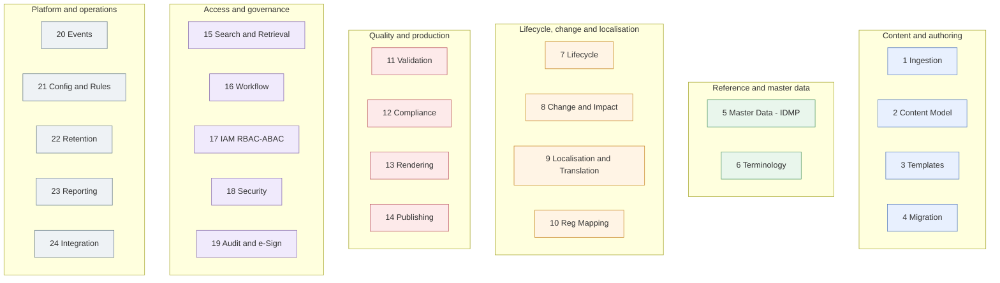
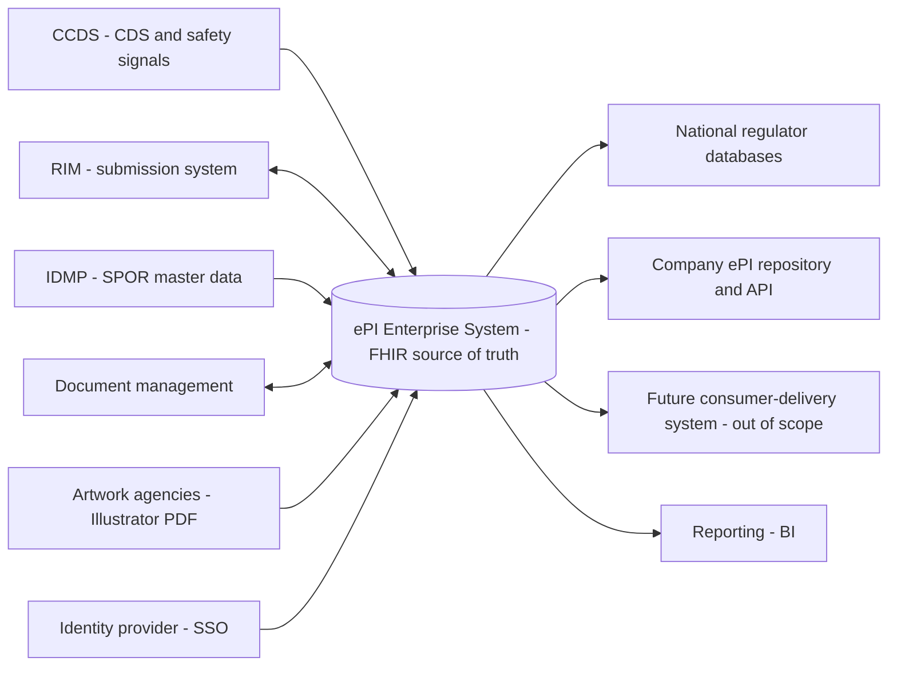
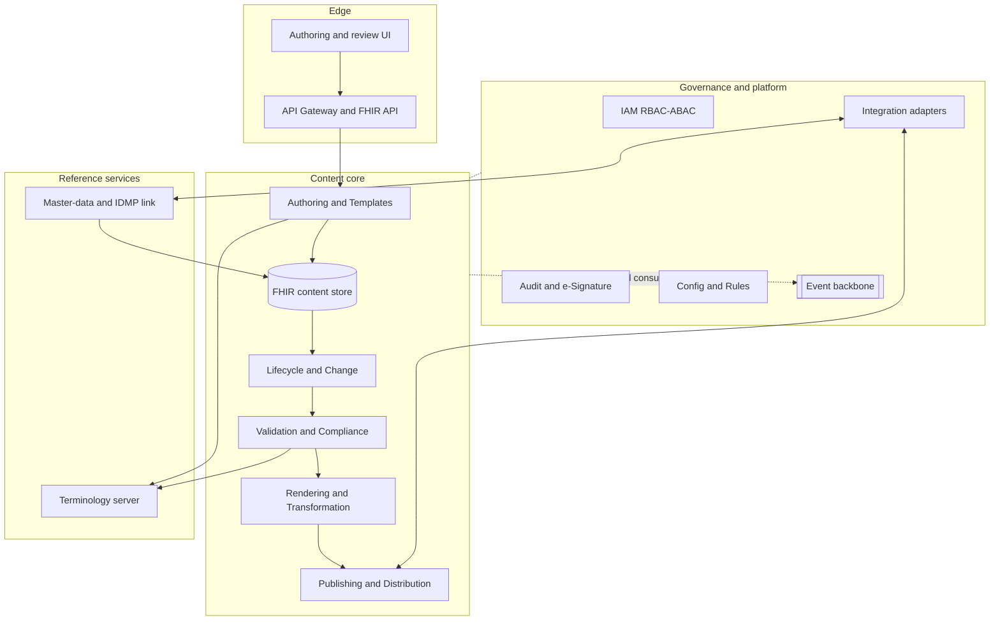

# D1 - Solution Overview Specification
## FHIR ePI Enterprise System

**Status:** Draft v0.1, **Date:** 2026-08-13, **Audience:** Internal engineering (delivery orientation)
**Companion documents:** D2 Detailed Capability Specification, D3 Detailed Technical Architecture
**Governing scope:** see *Deliverables Definition* (this project)

---

## 1. Introduction

### 1.1 Problem statement
Regulated product information (the SmPC, package leaflet, labelling, and their equivalents in each market) is today authored and managed largely as unstructured documents (Word, PDF) inside document-management and regulatory systems. That model does not support the structured, machine-readable, multi-channel product information that regulators are now moving to - the **electronic Product Information (ePI)** - nor does it make lifecycle, change propagation, and cross-market consistency tractable at enterprise scale.

This programme builds an **enterprise ePI system**: a single authoritative platform to ingest, author, validate, manage the full lifecycle of, and publish product information as **FHIR, PDF, and HTML** representations, across multiple countries, regulators, and local affiliates.

### 1.2 Business drivers
- **Regulatory mandate and momentum.** The EU ePI initiative and its roadmap, national ePI programmes, and the FDA's structured labelling establish structured product information as a near-term compliance requirement, not an option.
- **Multi-market complexity.** A single product carries many market/language/regulator variants; managing them as documents is error-prone and slow.
- **Change safety.** A CCDS or safety-signal change must propagate predictably to every affected label and submission; today that traceability is manual.
- **Efficiency and consistency.** Structured, template-driven, single-sourced content reduces rework, translation cost, and compliance risk.

### 1.3 Objectives
1. One authoritative, FHIR-native source of truth for product information across all in-scope markets.
2. Structured authoring that shields authors from raw FHIR complexity while producing conformant ePI.
3. Deterministic lifecycle, version, and change management with full impact analysis.
4. Automated validation and regulatory-completeness checking against per-market templates.
5. Reliable rendering and publishing of FHIR/HTML/PDF representations to downstream channels.
6. GxP-grade audit, e-signature, and access control throughout.

### 1.4 How to read this document
D1 is breadth-first: it frames the system, fixes scope, and presents the **capability map** that D2 specifies in depth and D3 realises. D1 does **not** define detailed requirements (D2) or physical design (D3). Terms are defined at first use; a consolidated glossary is a shared cross-cutting artefact.

---

## 2. Scope

### 2.1 In scope
- Ingestion, authoring, lifecycle, validation, compliance checking, rendering, and publishing of ePI content.
- The three canonical representations: **FHIR ePI** (structured source of truth), **HTML**, and **PDF** (both rendered from FHIR).
- Multi-region, multi-language, multi-regulator, and multi-affiliate management.
- Linkage to regulated master data (IDMP/SPOR) and to regulatory submissions/variations.
- GxP compliance: audit trail, electronic signatures, access control, records retention.

### 2.2 Out of scope (boundaries)
- **Consumer/patient-facing delivery and ePI "focusing"** (Gravitate Health-style personalisation). This system is the authoritative back-office source that *publishes* approved ePI to channels; consumer delivery is a separate, later solution - most likely a third-party product - that this system feeds. See Section 6.4.
- **Print/packaging artwork authoring.** Leaflet and carton artwork (DTP, graphics, pictograms, Braille layout) is produced by external agencies in Adobe Illustrator and delivered as print-ready PDF. This system ingests and links that artwork as a managed asset for reference/reconciliation but does not author it. Note the two distinct PDF lineages in Section 3.3.
- **Regulatory submission publishing/dispatch** (eCTD assembly, gateway submission) - integrated with, not owned by, this system.
- **Master-data authorship.** IDMP/SPOR data is sourced/referenced, not mastered here.

### 2.3 Target markets and regulators
Multi-region by design. Initial regulatory driver is the **EU** (EMA ePI / EMRN), followed by the **US** (FDA SPL) and additional national schemes (e.g. MHRA, Swissmedic, Health Canada). Region/regulator onboarding is configuration-driven (see Section 6.1) so new markets do not require code releases.

### 2.4 Target-state vs phased delivery
The capability map (Section 5) is the **target state**. Delivery is phased (Section 11). D2 records, per capability, a target-state definition and a delivery phase; this document plans the full target deliberately to surface the architectural choices (Section 6) that are expensive to retrofit.

---

## 3. Domain primer

### 3.1 What ePI is
**ePI (electronic Product Information)** is the regulated information about a medicine - indications, posology, contraindications, warnings, adverse reactions, and so on - represented in a **structured, machine-readable** form rather than only as a formatted document. The anchor standard is the **HL7 FHIR Implementation Guide for Electronic (Medicinal) Product Information**, in which an ePI document is a FHIR **`Bundle`** of type *document*, anchored by a **`Composition`** whose nested **sections** carry the labelling content, with references to product data resources (e.g. `MedicinalProductDefinition`, `Ingredient`, `Organization`). Content can be structured (coded, referenceable) or narrative.

### 3.2 The regulatory landscape (and why it differs by market)
The same conceptual leaflet is expressed differently by scheme, which is why per-market **mapping**, **templates**, and **conformance profiles** are first-class in this system:

| Scheme | Owner | Form | Notes |
|---|---|---|---|
| **HL7 Global Core ePI FHIR IG** | HL7 / Vulcan | FHIR (Bundle/Composition) | The canonical structured baseline this system builds on. |
| **EU ePI (EMRN ePI IG) + QRD** | EMA / EMRN | FHIR profiles + QRD templates | EU common standard; SmPC/PL/labelling structure; PLM portal ecosystem. |
| **US SPL** | FDA / HL7 v3 | HL7 v3 XML, LOINC-coded sections | Distinct model from FHIR ePI; requires mapping/transform. |
| **Other national** | e.g. MHRA, Swissmedic, HC | National variants | Layered as national extensions/profiles over the core. |

### 3.3 The three representations (and the two PDF lineages)
- **FHIR ePI** - the structured **source of truth**. Everything else derives from it.
- **HTML** - rendered from FHIR for electronic display and downstream channels.
- **PDF (rendered)** - rendered from FHIR for regulatory/electronic distribution.
- **PDF (artwork)** - a *separate* print-ready PDF produced by agencies for physical packs. It is **not** system-rendered; it is ingested and linked to the approved label version for reference/reconciliation. D3 must keep these two PDF lineages explicitly distinct.

### 3.4 Master data: IDMP and SPOR
**ISO IDMP** (identification of medicinal products; ISO 11615/11616/11238/11239/11240) gives globally consistent identifiers for products, substances, and organisations. EMA's **SPOR** operationalises this as **S**ubstance (SMS), **P**roduct (PMS), **O**rganisation (OMS), and **R**eferential (RMS) master-data services. ePI content references SPOR/IDMP identifiers so that a label is unambiguously linked to the regulated product it describes. This system **references** that master data; it does not master it.

### 3.5 Change origin and traceability
Regulated labelling derives from a controlled source - typically the **CCDS/CDS** (company core data sheet) and clinical safety signals. A core governance expectation is that every label section traces to an **approved source origin**, and that a source change (a CCDS update, a safety signal) propagates with full **impact analysis** to every affected market label and its regulatory **variation**. This drives capabilities #8 (Change Management) and #12 (Compliance & Completeness).

### 3.6 Compliance context
The system operates under **GxP**; electronic records and signatures fall under **US 21 CFR Part 11** and **EU Annex 11**. Consequences run through the whole architecture: comprehensive tamper-evident audit, e-signature at approval gates, segregation of duties, records retention, and - critically - the system must itself be **validatable** under a CSV / GAMP 5 approach (Section 6.2).

---

## 4. Stakeholders and actors

| Actor | Role in the system |
|---|---|
| **Global regulatory / labelling author** | Authors and updates core and market content via templates. |
| **Local affiliate regulatory user** | Manages country/language variants within their affiliate scope. |
| **Reviewer / approver** | Reviews and applies e-signature at approval gates (segregation of duties enforced). |
| **Template owner** | Maintains label-type templates and their conformance mapping. |
| **Publisher / regulatory ops** | Manages publication, effective-dating, and channel dispatch. |
| **QA / compliance** | Runs completeness/compliance checks; oversees CDS-origin traceability. |
| **Auditor / inspector (internal & regulatory)** | Read-only inspection role: audit-trail search, record reconstruction. |
| **System / configuration administrator** | Manages markets, rules, terminology, and delegated administration. |
| **Downstream systems** | RIM/submission, DMS, artwork asset hand-off, national regulator databases, and the future consumer-delivery system. |

---

## 5. Capability map (target state)

The system comprises **24 target capabilities** in six domains. Each is one line here and fully specified in D2. (Numbers are stable across D1-D3.)

**Content & authoring**
1. Ingestion & Import
2. Structured Content Model
3. Template & Label-Type Management
4. Data Migration & Legacy Onboarding

**Reference & master data**
5. Master Data & Identifiers
6. Terminology & Code System Management

**Lifecycle, change & localisation**
7. Lifecycle & Version Management
8. Change Management & Impact Analysis
9. Localisation, Multi-region & Translation Management
10. Regulatory Mapping & Conformance Profiles

**Quality & production**
11. Validation & Quality
12. Compliance & Completeness Checking
13. Rendering & Transformation
14. Publishing & Distribution

**Access & governance**
15. Search, Access & Retrieval
16. Workflow & Approvals
17. Identity, Access Control & Permissions (RBAC/ABAC)
18. Security
19. Audit Trail, e-Signature & Inspection Support

**Platform & operations**
20. Notifications, Events & Subscriptions
21. Configuration & Business-Rule Management
22. Records Retention & Archival
23. Reporting & Analytics
24. External Integration

---

## 6. Solution context

### 6.1 System context
The ePI system sits between content/master-data sources and publication channels, with governance services cutting across.

### 6.2 Upstream / downstream
- **Upstream:** CCDS/CDS and safety signals (change origin); IDMP/SPOR master data; existing document/RIM systems (migration and reference); agency artwork PDFs; identity provider.
- **Downstream:** national regulator databases/portals; a company ePI repository and API; the future consumer-delivery/focusing system (fed via clean published content and API); reporting/BI.

### 6.3 Boundaries
The system owns the **structured ePI content lifecycle and its published representations**. It integrates with - but does not own - submission dispatch, artwork authoring, master-data authorship, or consumer delivery.

---

## 7. Guiding architecture

D3 is prescriptive; D1 fixes the shape and the rationale for the greenfield posture.

### 7.1 High-level logical architecture
A **cloud-native, API-first, event-driven** platform with a **FHIR-native content store** at its core, organised as cooperating services aligned to the capability domains, behind a common governance layer (IAM, audit, config).

### 7.2 Key patterns
- **FHIR-native core** - the ePI Bundle is the canonical model; representations derive from it.
- **Event-driven backbone** - change propagation, impact analysis, notifications, and integration ride on events (Section 6.1 decision).
- **Config-as-data** - markets, regulators, rules, and terminology bindings are configuration, not code.
- **Separation of canonical vs rendered content** - FHIR source vs generated HTML/PDF and ingested artwork.
- **Governance as a cross-cutting layer** - IAM, audit/e-signature, and configuration apply uniformly to every capability.

### 7.3 Why greenfield
The target combines a FHIR-native store, structured authoring, deterministic lifecycle/change, and GxP governance in a way existing document-centric platforms do not provide coherently. A greenfield, capability-aligned build lets the data model, extensibility, and validatability be right from the start; integration (not replacement) is used for submission, DMS, master data, and artwork. Concrete component and stack selection is D3.

---

## 8. Architecture principles & standards baseline

### 8.1 Principles (stated here, resolved in D3 as ADRs)
1. **FHIR-native, standards-first** - conform to the ePI IG; represent, don't reinterpret.
2. **Single source of truth** - one canonical FHIR representation; all outputs derive from it; content reuse is modelled, not copied.
3. **Config-as-data extensibility** - a new market/regulator/rule/terminology is configuration.
4. **Event-driven** - state changes are events; propagation and integration are asynchronous by default.
5. **Secure & compliant by design** - RBAC/ABAC, segregation of duties, tamper-evident audit, e-signature, retention - built in, not added.
6. **Validatable by design (GxP/CSV)** - environment control, traceability, and testability are architectural requirements.
7. **API-first & interoperable** - every capability is reachable via a governed, versioned API; the FHIR API is the primary contract.
8. **Cloud-native & automatable** - containerised, IaC-managed, CI/CD with controlled release.
9. **Separation of concerns** - canonical vs rendered content; internal lifecycle state vs per-market regulatory-approval state.

### 8.2 Standards register (baseline - versions confirmed in D3)
| Standard | Use in system |
|---|---|
| **HL7 FHIR (R4/R5) + Global Core ePI IG (STU1; v1.1.0 in build)** | Canonical ePI representation. |
| **EMA EMRN ePI IG + EU QRD templates** | EU profiles, templates, conformance. |
| **FDA SPL (HL7 v3)** | US mapping/transform target. |
| **ISO IDMP (11615/11616/11238/11239/11240) + EMA SPOR** | Product/substance/organisation identity and referentials. |
| **Terminologies: SNOMED CT, EDQM standard terms, UCUM, MedDRA, ISO 639/3166, LOINC** | Coding and value-set binding. |
| **21 CFR Part 11, EU Annex 11, GxP / GAMP 5** | Electronic records/signatures, computer-system validation. |
| **OAuth2 / OIDC / SAML** | Authentication and federation. |

### 8.3 Target-state architecture decisions (must be fixed in target planning)
Carried from the Deliverables Definition Section 6; stated as principles here, resolved with rationale in D3:
- Canonical information model & content reuse, Event-driven backbone, Config-as-data extensibility, Multi-tenancy & data partitioning for affiliates, Identifier & versioning scheme, Regulatory-approval state vs internal lifecycle, CSV/GAMP 5 validatability, Public API & versioning policy, Effective-dating/scheduling/embargo.

---

## 9. Non-functional summary
Headline NFRs only; architected in D3.

| Attribute | Target direction (to be quantified in D3) |
|---|---|
| **Availability** | High availability for authoring/publishing; defined RTO/RPO and DR. |
| **Integrity** | No silent data loss; tamper-evident, immutable audit; deterministic versioning. |
| **Security** | Encryption in transit/at rest; least-privilege RBAC/ABAC; affiliate isolation. |
| **Compliance** | 21 CFR Part 11 / Annex 11 conformance; validatable (GAMP 5). |
| **Scalability** | Scales by product/market/language volume and concurrent authoring; async for heavy transform/publish. |
| **Performance** | Responsive authoring; bounded, observable rendering/validation pipelines. |
| **Auditability & retention** | Full history reconstruction; GxP retention schedules and legal hold. |
| **Interoperability** | Standards-conformant FHIR API; stable, versioned contracts. |
| **Observability** | End-to-end tracing of content through ingest->validate->publish. |

---

## 10. Risks, assumptions, dependencies, open decisions (RAID)

**Assumptions**
- Compliance regime is GxP + 21 CFR Part 11 + EU Annex 11 (to confirm).
- IDMP/SPOR and RIM/submission systems exist and are integrated with, not built here.
- Artwork is agency-produced (Illustrator/PDF); translation is in-system; consumer delivery is out of scope (option A).

**Dependencies**
- Availability and quality of IDMP/SPOR master data and CCDS/CDS source content.
- Stability of the ePI IG and EU/national profiles during build.
- Identity provider and enterprise integration endpoints.

**Risks**
- **Standards flux** - ePI IG / EU profiles evolving; mitigated by config-as-data and profile versioning.
- **Legacy migration volume/quality** - unstructured legacy labels are costly to structure; mitigated by a dedicated migration capability (#4) and phased onboarding.
- **Regulatory-timeline pressure** (EU ePI milestones) - mitigated by EU-first phasing.
- **Scope creep toward consumer delivery/focusing** - mitigated by the firm option-A boundary.
- **CSV overhead** - validatability must be designed in to avoid late, expensive rework.

**Open decisions**
1. Technology and architecture selection (cloud platform, application stack, FHIR server, component products) is deferred to D3. D3 evaluates options and recommends with rationale (ADRs); no stack is pre-committed in D1. D1 commits only to architectural style and principles (cloud-native, API-first, event-driven, FHIR-native), not to products.
2. Any mandated FHIR server or existing components to reuse - a constraint that feeds D3's selection (see explanation below). To confirm before D3.
3. Confirm compliance regime scope (assumed above).

---

## 11. Delivery roadmap (phased toward target)

Target-state capabilities delivered in phases; each phase is independently valuable and testable.

| Phase | Theme | Primary capabilities | Outcome |
|---|---|---|---|
| **P0** | Foundations | 2, 5, 6, 17, 18, 19, 21 | FHIR core, terminology, identity, audit, config - the validatable spine. |
| **P1** | Author -> manage (EU) | 1, 3, 7, 9, 16 | Template-driven authoring, lifecycle, EU localisation, approvals. |
| **P2** | Assure -> publish (EU) | 10, 11, 12, 13, 14, 20 | Mapping, validation, compliance, rendering, publishing, events. |
| **P3** | Change & multi-region | 8, 9(+markets), 10(+US/national), 24 | Change/impact, US SPL + national schemes, RIM/DMS integration. |
| **P4** | Scale & operate | 4, 22, 23 | Legacy migration at scale, retention/archival, reporting/analytics. |

Sequencing rationale: establish the validatable FHIR spine (P0) before content flows; deliver an end-to-end EU thread (P1-P2) before broadening markets (P3); treat large-scale legacy migration and analytics as hardening (P4). Migration (#4) tooling is built early but run at scale once the core is stable.

---

*End of D1 v0.1. Next: D2 specifies each capability against the fixed template; D3 resolves the Section 8.3 decisions and the open decisions in Section 10.*
